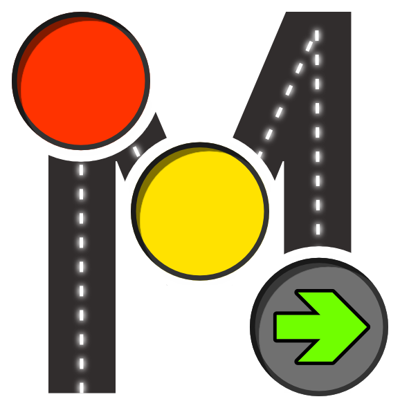
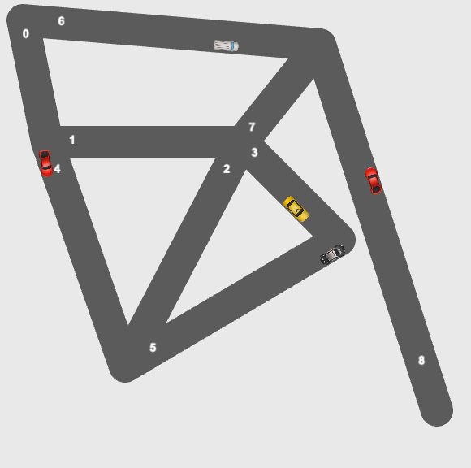

phaser-microlight
===
> vehicle behavior / traffic light simulation based on phaser 🚦🚗




[](https://anoff.github.io/phaser-microlight)

>**Note:**
This is a little playground of mine to play around with the [Phaser](https://phaser.io) game engine. It is not really considered to be (or become) a fully functional game.


You can find the latest version running on my [github pages](https://anoff.github.io/phaser-microlight/)

## Features

* es6 module loader using webpack
* draw street layout based on OSM imports
* spawn cars at random positions on the street
* add additional cars by hitting the `SPACE` key
* cars accelerate and decelerate into intersections
* random turns at intersection to neighboring streets
* car collision
    * need to be on same street and same heading direction
    * the older of the two cars gets removed

## Ideas

* [ ] introduce traffic lights that _block_ intersections
* [ ] make cars stop if another car is in front
* [x] grab street layouts from real world cities via OSM/gmaps API
* [ ] interactive mode to create street layout
* [ ] adapt 

## Getting started

In case you want to run the stuff yourself locally

```bash
# install dependencies
npm install
# start dev server
npm start
```

### Getting OSM street data

```sh
# download a dumpy (lower left corner lng,lat -> top right lng,lat)
curl "https://api.openstreetmap.org/api/0.6/map?bbox=9.2055000,48.9407000,9.2643,48.9582" > marbach.osm

# turn import into a JSON file to load into the game (adapt filename in code)
node map-import.js > map.json
```

## Credits

* Car sprites: [unluckystudio.com](http://unluckystudio.com/game-art-giveaway-7-top-down-vehicles-sprites-pack/)

## License

MIT © [Andreas Offenhaeuser](http//anoff.io)
